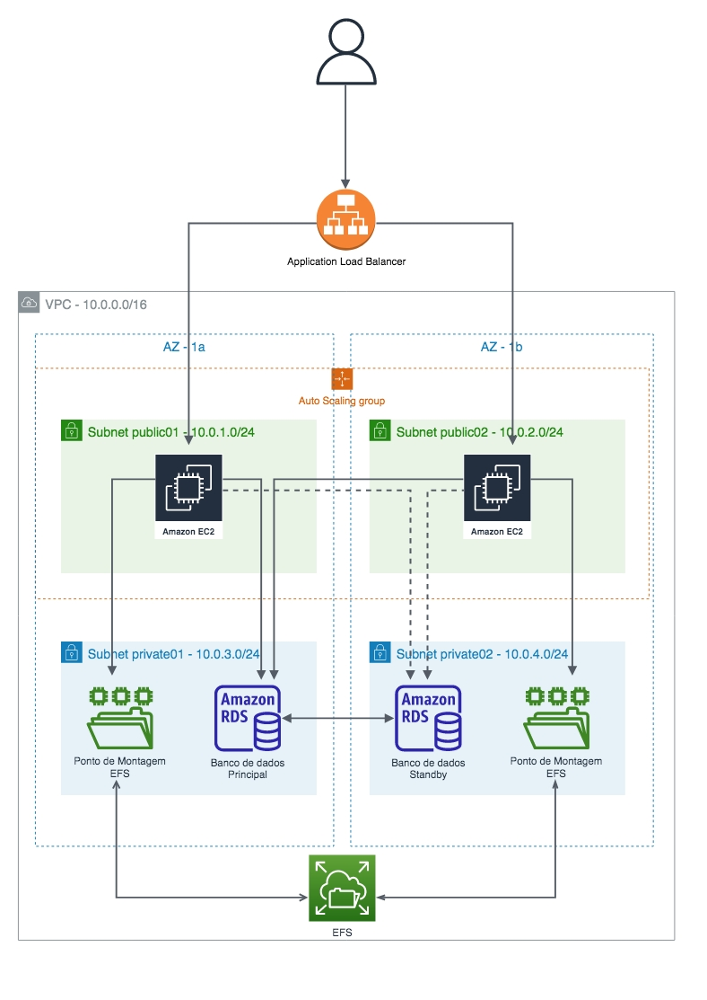
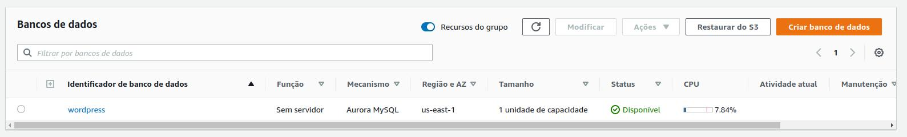
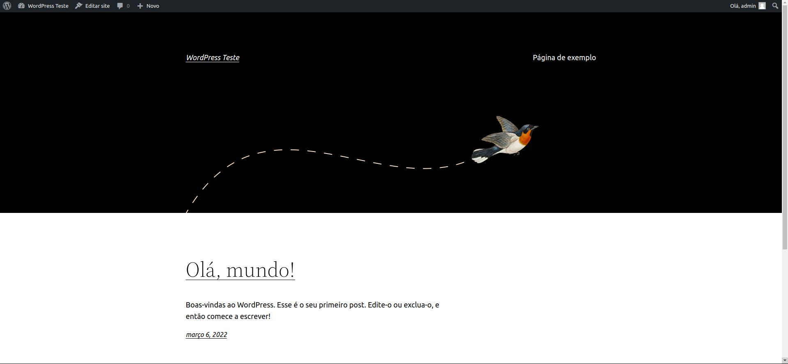

# Documentação do Projeto

## Arquitetura

    - AWS Auto Scaling
    - Load Balance Gerenciando as isntancias EC2 
    - Banco de dados Aurora/MySql serveless
    - Backus S3 (cliente trabalha com imagens fixas)
    

## Execução

Inciei uma instancia EC2 com WordPress e suas dependencias.

[Script Utilizado](https://github.com/rafael-rsr/projeto1AWS/blob/main/userdata.sh)

Configurei o Apache para o WordPress em /etc/apache2/sites-available/wordpress.conf contendo:

            <VirtualHost *:80>
                DocumentRoot /srv/www/wordpress
                <Directory /srv/www/wordpress>
                    Options FollowSymLinks
                    AllowOverride Limit Options FileInfo
                    DirectoryIndex index.php
                    Require all granted
                </Directory>
                <Directory /srv/www/wordpress/wp-content>
                    Options FollowSymLinks
                    Require all granted
                </Directory>
            </VirtualHost>

Posteriormente ativei com os comandos:
    
            sudo a2ensite wordpress (para habilitar)

            sudo a2enmod rewrite (para ativar a reescrita)

            sudo a2dissite 000-default (para desativar o site padrão)
    

Utlizei o RDS para criar um banco de dados Aurora/MySql Serveless

Configurei o Banco de dados dentro do servidor com os seguntes comandos:

-# copia o arquivo de amostra para o arquivo de configuração do Wordpress (wp-config):

            sudo -u www-data cp /srv/www/wordpress/wp-config-sample.php /srv/www/wordpress/wp-config.php

-# Em seguida defeni as credencias do banco de dados:

            sudo -u www-data sed -i 's/database_name_here/wordpress/' /srv/www/wordpress/wp-config.php
            sudo -u www-data sed -i 's/username_here/wordpress/' /srv/www/wordpress/wp-config.php
            sudo -u www-data sed -i 's/password_here/<your-password>/' /srv/www/wordpress/wp-config.php

WordPress ativo

